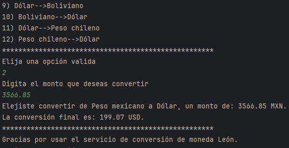

# 💰 Desafío conversor de moneda 💰
## 📜 Descripción de proyecto
_El objetivo de este desafío es crear una aplicación que nos 
permita implementar los conocimientos adquiridos sobre la 
programación orientada a objetos y el uso de APIs para la 
automatización de actualizaciónd de datos a tracés del uso de
plataformas de terceros._

## 📋 Caracteristicas principales
* Obtención de datos actualizados: Por medio de una API, se
 hacen las solicitudes de datos para contar con los valores
 de las tasas de tipo de cambio de forma actualizada.> 
* Aplicación de los conceptos de programación orientada a 
objetos para consolidar conocimientos de clases, objetos, 
listas, interfaces, encapsulamiento, métodos, entre otros 
conceptos.

## 💻 Tecnologías utilizadas
>* Lenguaje: Java
>* IDE: IntelliJ IDEA
>* API de divisas: ExchangeRate-API

## 💽 Instalación y configuración
Para replicar el presente programa y que corra correctamente
en tu computadora sigue lo siguientes pasos:
1. Clonar el repocitorio en tu ordenador.
2. Crea tu propia apiKey entrando a https://www.exchangerate-api.com
3. Una vez que cuentes con tu apiKey configurala en tus variables de entorno:
   1. Busca "Editar las variables de entorno del sistema" -> Variables de entorno -> Nueva
      * Nombre: `EXCHANGE_RATE_KEY`
      * Valor: *Coloca tu apiKey creada*
   2. Para configurar la variable en IntelliJ:
      * Busca el menú `Run` -> `Edit Configurations`
      * Selecciona tu clase principal dando click en `+` y selecciona `Aplication`
      * En la ventana que se despliega selecciona la clase `Principal` en el campo `Main class`
      * Posteriormente en `Enviroment variables` escribe` EXCHANGE_RATE_KEY=TU_APIKEY`
      * Por último da click en `Apply` y luego en `OK`
4. Una vez configurado todo, abre el proyecto en IntelliJ IDEA
5. Ejecuta la clase Principal.

## 🔦 Uso
* Una vez inicializado lee atentamente las opciones configuradas para conversión.
* Selecciona la opción deseada en donde `0` es para finalizar el programa.
* Posteriormete ingresa el monto del que deseas la conversión de moneda.
* Con lo cuál el programa te entregará la información de conversión de la siguiente forma:
    + >Elejiste convertir de Dólar a Peso mexicano, un monto de: 2.00 USD.
La conversión final es: 35.84 MXN.

## 📄 Licencia
Este proyecto está bajo la Licencia MIT. Consulta el archivo `LICENSE` para más detalles.

## 📪 Contacto

